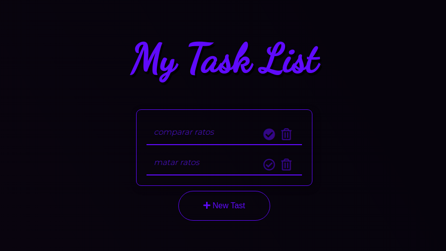
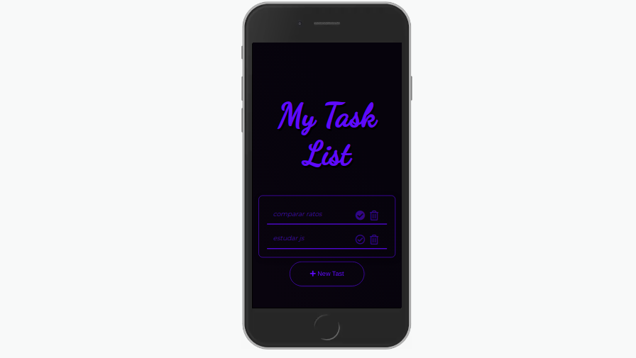
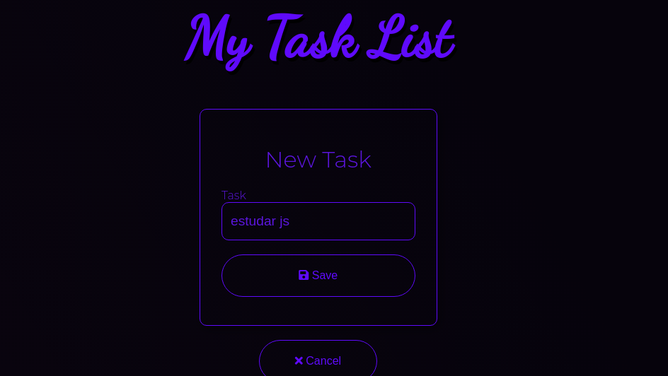
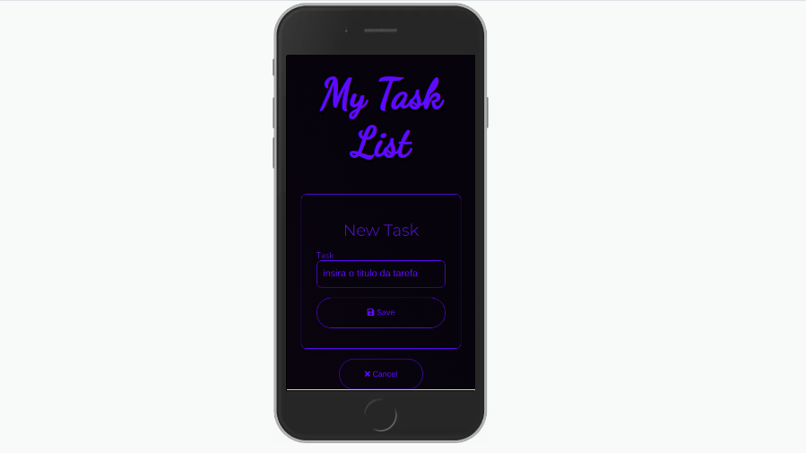
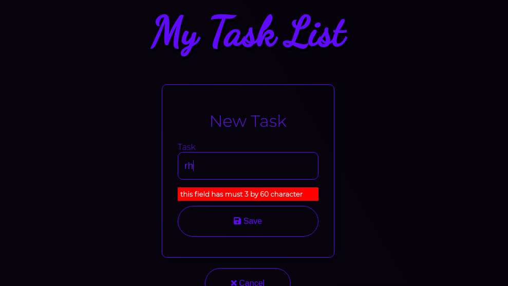

# TodoListAngular

This project was generated with [Angular CLI](https://github.com/angular/angular-cli) version 7.2.2.

## Install App Dependencies

Run `npm install` in your terminal

## Development server

Run `ng serve` for a dev server. Navigate to `http://localhost:4200/`. The app will automatically reload if you change any of the source files.

## About Project

this is a project that make task management

Which Are Tech was used?

<ul>
  <li>Angular v7</li>
  <li>Font Awesome</li>
  <li>Animate css</li>
</ul>

What Project Do it?

<ul>
  <li>List All Task</li>
  <li>Delete Especific Task</li>
  <li>Mark Done Especific Task</li>
  <li>Mark UnDone Especific Task</li>
  <li>Add New Task</li>
</ul>

## Project Description

<em>This Picture Show About List Task that was Added</em>

<h4>DeskTop View mode</h4>
 

 
<h4>Mobile View mode</h4>
 

 
 

<em>This Picture Show About Add New Task</em>

<h4>DeskTop View mode</h4>
 

 
<h4>Mobile View mode</h4>
 

 
 

<em>This Picture Show About Fiel Validate</em>
 

 

## Code scaffolding

Run `ng generate component component-name` to generate a new component. You can also use `ng generate directive|pipe|service|class|guard|interface|enum|module`.

## Build

Run `ng build` to build the project. The build artifacts will be stored in the `dist/` directory. Use the `--prod` flag for a production build.

## Running unit tests

Run `ng test` to execute the unit tests via [Karma](https://karma-runner.github.io).

## Running end-to-end tests

Run `ng e2e` to execute the end-to-end tests via [Protractor](http://www.protractortest.org/).

## Further help

To get more help on the Angular CLI use `ng help` or go check out the [Angular CLI README](https://github.com/angular/angular-cli/blob/master/README.md).
